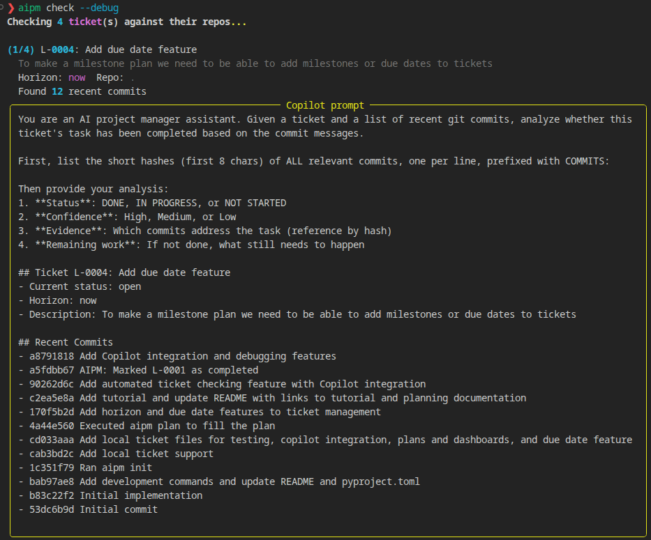
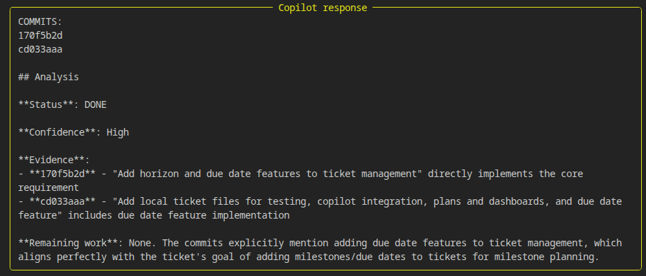
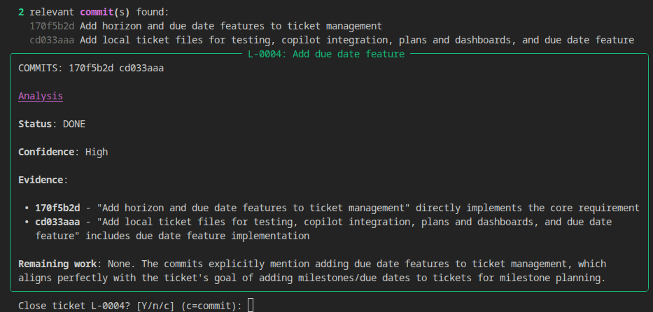

# Debugging AIPM

When Copilot analysis doesn't behave as expected, use the `--debug` flag to see exactly what's happening under the hood.

## Debug Mode for `aipm check`

Run with `--debug` (or `-d`) to print the full prompt sent to Copilot and the full response received:

```bash
aipm check --debug
aipm check L-0004 -d
```

### What you'll see

**1. The prompt** — the exact text sent to Copilot, including the ticket details and all recent commit messages:



**2. The analysis result** — Copilot's full response with status, confidence, evidence, and remaining work:



**3. The close prompt** — when Copilot recommends DONE, the default is set to `Y` (close). You can also choose `c` to close and commit in one step:



### When to use debug mode

- **Empty Copilot responses** — debug shows whether the prompt was sent correctly and what (if anything) came back
- **Wrong commit matching** — verify that the right commits appear in the prompt
- **Unexpected status** — see exactly what evidence Copilot used to reach its conclusion
- **Prompt tuning** — if Copilot's analysis is off, inspect the prompt to see what context it received

### Copilot SDK troubleshooting

If Copilot always returns empty responses:

1. **Check authentication** — run the bundled CLI and authenticate:
   ```bash
   .venv/lib64/python3.14/site-packages/copilot/bin/copilot
   # then type: /login
   ```

2. **Test connectivity** — run the SDK test script:
   ```bash
   uv run scripts/test_copilot_sdk.py
   ```
   This prints every event from the SDK and confirms whether messages are being received.

3. **Check permissions** — the bundled binary needs execute permissions:
   ```bash
   chmod +x .venv/lib64/python3.14/site-packages/copilot/bin/copilot
   ```

Without a working Copilot connection, all commands fall back to keyword-based analysis automatically.