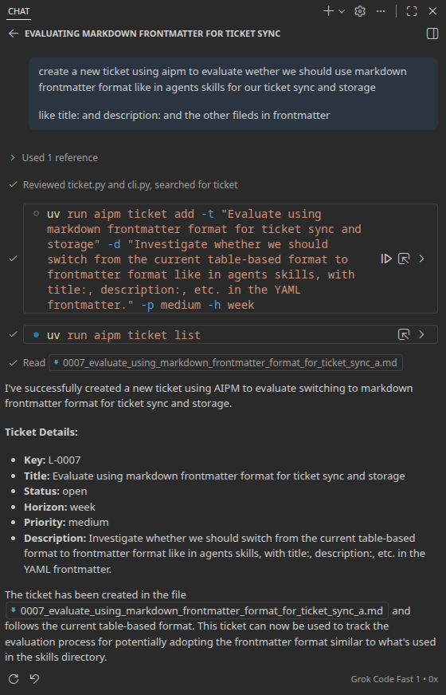

# Agent Skills Integration

AIPM is designed to work seamlessly with generic [Agent Skills](https://platform.claude.com/docs/en/agents-and-tools/agent-skills/overview) as used by Claude and other AI agents. This means you can use any standard Agent Skill with AIPM, and AIPM can be easily integrated into agent workflows.

## What are Agent Skills?

Agent Skills are reusable, filesystem-based resources that provide AI agents with domain-specific expertise, workflows, and best practices. They are not specific to AIPM, but can be used by any agent platform that supports the Agent Skills format.

Skills are typically directories containing a `SKILL.md` file (with YAML frontmatter for metadata and instructions), and may include scripts, reference docs, or other resources. See the [Agent Skills documentation](https://platform.claude.com/docs/en/agents-and-tools/agent-skills/overview) for details and examples.

## Example: Integrating AIPM with Agent Skills

- You can create a generic Agent Skill that calls AIPM commands (e.g., to add a ticket, generate a report, or sync issues) as part of a workflow.
- AIPM can be used as a backend for agent-driven project management, with skills providing the glue between agent reasoning and AIPM's CLI/API.

### Example Skill: [aipm-create-ticket](../skills/aipm-create-ticket/SKILL.md)

This skill demonstrates how to use AIPM from an agent workflow to create new tickets:

## Creating and Using Skills

To create a skill that works with AIPM:

1. Follow the [Agent Skills format](https://platform.claude.com/docs/en/agents-and-tools/agent-skills/overview) (create a directory with a `SKILL.md` file and any needed scripts).
2. Instruct the skill to call AIPM commands as needed (e.g., via bash or subprocess calls).
3. Use the skill with any agent platform that supports Agent Skills.

You can use existing Agent Skills with AIPM, or create new ones to automate and extend your project workflows.