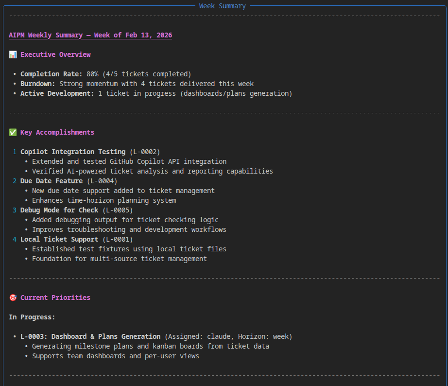

# Project Summary

`aipm summary` generates a high-level project report grouped by time horizon, based on your current tickets, goals, and milestones. When GitHub Copilot is available, the report is AI-generated with actionable insights; otherwise, a structured fallback is produced locally.

## How It Works

### 1. Collect tickets and context

AIPM reads all ticket files from `tickets/`, plus `goals.md` and `milestones.md`. Tickets are filtered by the requested **period** (time horizon) and optionally by **user**.

### 2. Generate the report

All ticket metadata — title, status, assignee, horizon — is sent to Copilot along with the project goals and milestones. Copilot produces a summary covering:

- Key accomplishments
- Current priorities and next tasks
- Progress toward goals
- Risks and blockers
- Recommended focus areas

When Copilot is unavailable, AIPM builds a structured report locally: tickets grouped by horizon, sorted by urgency, with a recommended-next-steps section.

### 3. Display

The report is rendered as a Rich Markdown panel in the terminal:




## Usage

```bash
# Default: this week's summary for all users
aipm summary

# Today's urgent items
aipm summary day

# Full picture across all horizons
aipm summary all

# Filter by user
aipm summary week alice

# Show the Copilot prompt and raw response
aipm summary --debug
```

### Arguments

| Argument | Default | Description |
|----------|---------|-------------|
| `PERIOD` | `week` | Time horizon filter: `day`, `week`, `month`, `year`, or `all` |
| `USER` | `all` | Assignee filter: `all`, `me`, or a specific username |

### Options

| Option | Description |
|--------|-------------|
| `--debug`, `-d` | Print the full Copilot prompt and response for debugging |

## Period Mapping

Each period includes tickets from matching horizons:

| Period | Included horizons |
|--------|-------------------|
| `day` | `now` |
| `week` | `now`, `week` |
| `month` | `now`, `week`, `next-week`, `month` |
| `year` | `now`, `week`, `next-week`, `month`, `year` |
| `all` | All horizons |

## Copilot-unavailable fallback

Without Copilot, the report is still useful — tickets are grouped by horizon with status, assignee, due dates, and priority highlighted. High-priority items are marked with ⚡.

## See Also

- [Planning & Time Horizons](planning.md) — how horizons work
- [Debugging Copilot](debug.md) — troubleshoot connectivity issues